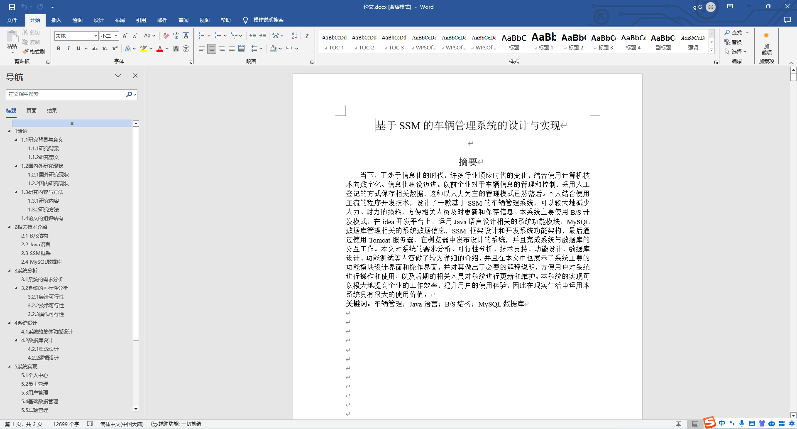
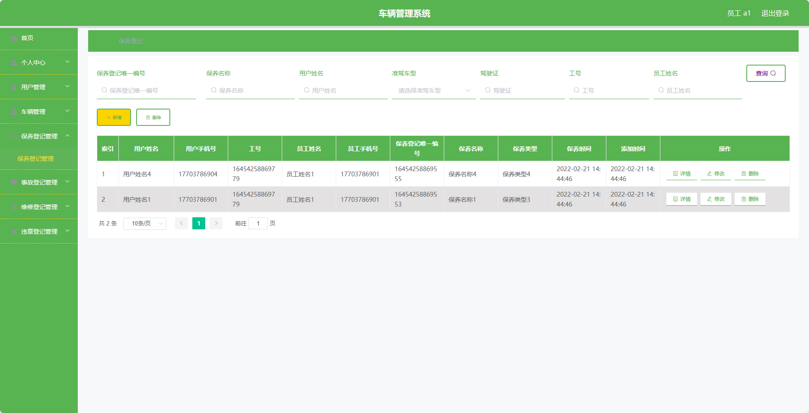
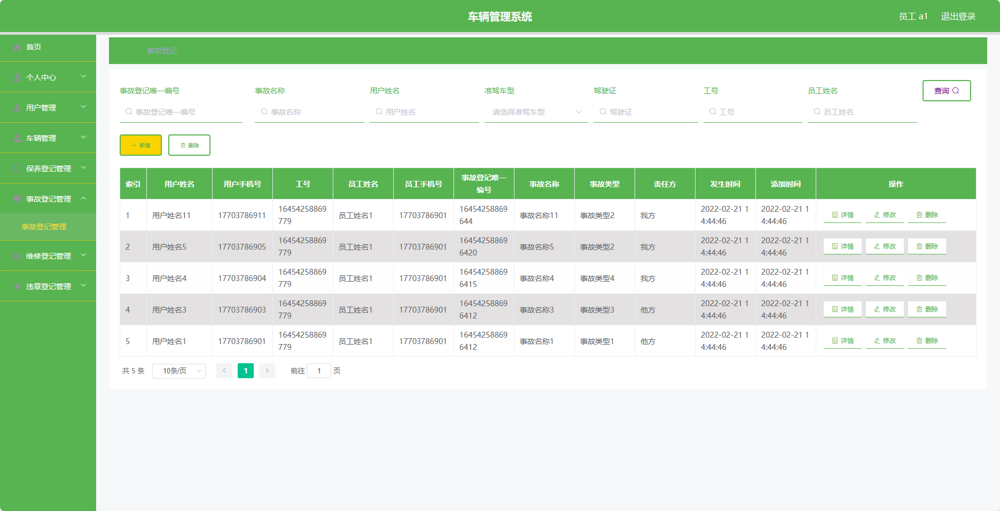
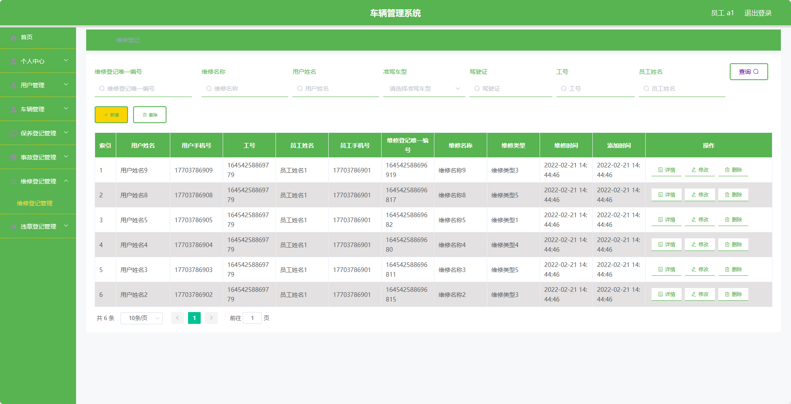
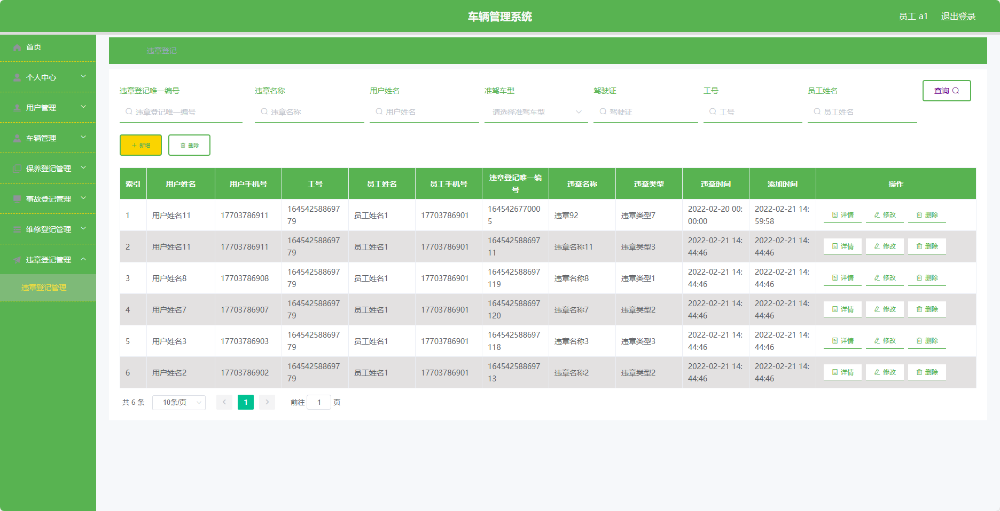
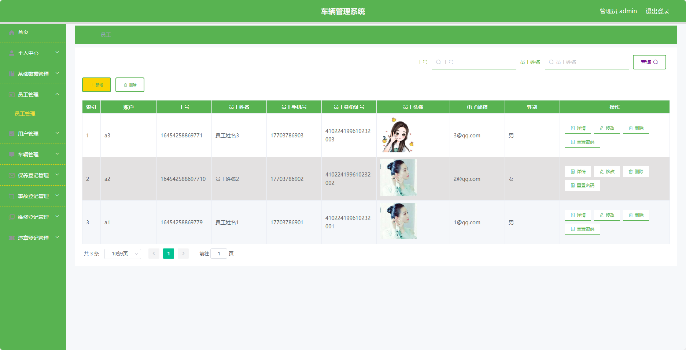
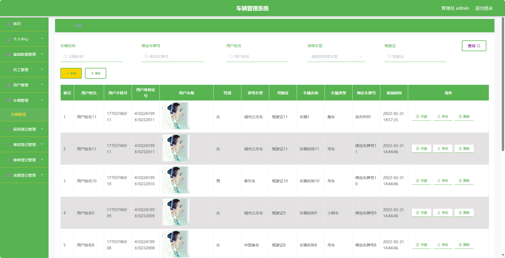
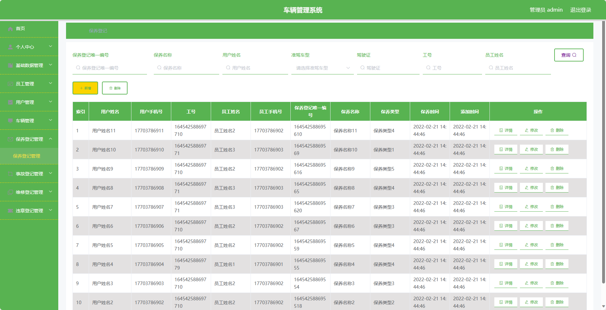
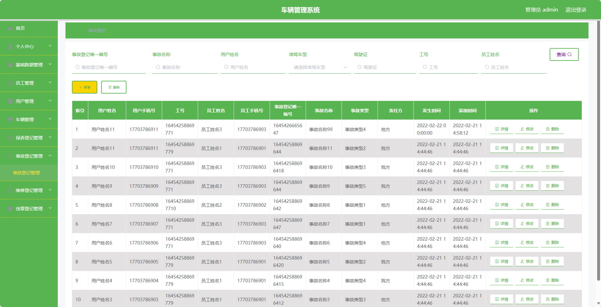

## 基于SpringBoot的车辆管理系统(程序+报告)

###  获取sql数据库文件: 从戎源码网 (https://armycodes.com/) QQ: 386869957 QQ群: 377586148
###  所有系统地址: (https://github.com/YuLin-Coder/AllProjectCatalog) 
###  所有项目以及源代码本人均调试运行无问题 可支持远程安装部署调试、定制修改、代码讲解

## 项目介绍
基于SpringBoot的车辆管理系统，系统包含两种角色：管理员、用户,主要功能如下。

### 【管理员】:
- 个人中心：管理个人信息。
- 基础数据管理：管理系统基础数据。
- 员工管理：管理员工信息。
- 用户管理：管理用户信息。
- 车辆管理：管理车辆信息。
- 保养登记管理：管理车辆保养登记的相关信息。
- 事故登记管理：管理车辆事故登记的相关信息。
- 维修登记管理：管理车辆维修登记的相关信息。
- 违章登记管理：管理车辆违章登记的相关信息。

### 【用户】:
- 个人中心：管理个人信息。
- 用户管理：管理其他用户信息。
- 车辆管理：管理车辆信息。
- 保养登记管理：登记车辆保养的相关信息。
- 事故登记管理：登记车辆发生事故的相关信息。
- 维修登记管理：登记车辆维修的相关信息。
- 违章登记管理：登记车辆违章的相关信息。

## 项目技术
- 编程语言：Java
- 数据库：MySQL
- 项目管理工具：Maven
- 前端技术：HTML、CSS、JavaScript、Jquery、Vue
- 后端技术：Spring、SpringMVC、MyBatis

## 运行环境
- JDK版本：JDK1.8及以上
- 开发工具：IDEA、Ecplise、Myecplise都可以
- 数据库: MySQL5.7及以上
- Maven：maven3.0及以上
- Node：14.14.0及以上

## 运行截图

